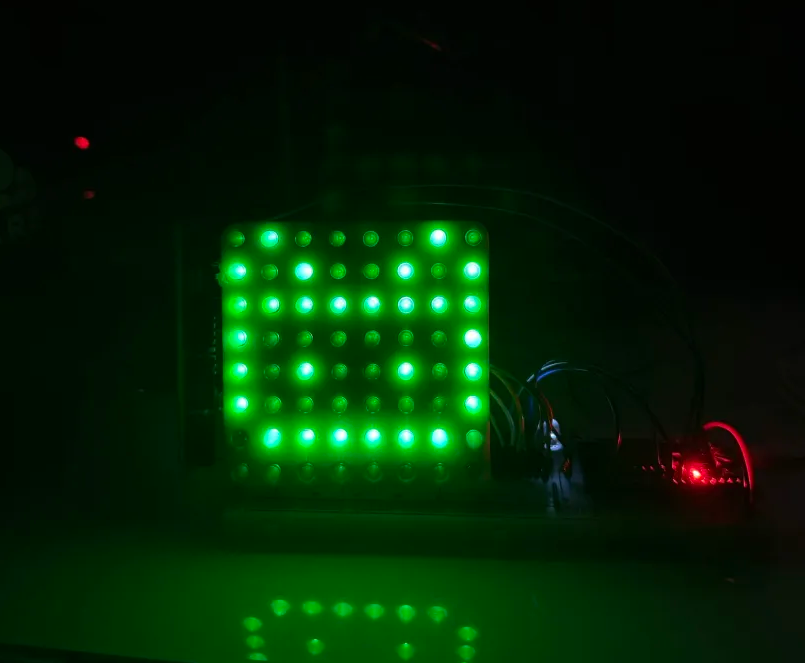

# LED matrix

Code and 3d print files for my lil LED matrix `=^・ω・^=`

## What is the point

To show that I can make a half-polished LED matrix from scratch using:

- 5 mm LEDs (x64)
- A 3rd printer
- 74HC595 shift registers (x2)
- 200-ohm resistors (x8)
- An ESP32 with 5 pinouts

## What can it do

- Display 8x8 images with bitdepth of 1

## Up and coming features

- Increase bitdepth
- Add video streaming
- Add arcade games
