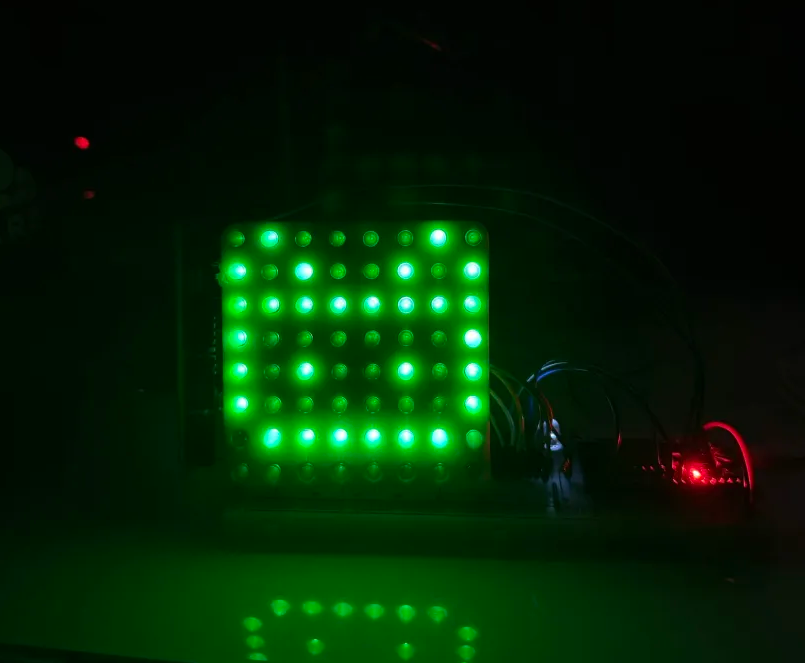

# LED matrix

Code and 3d print files for my lil LED matrix `=^・ω・^=`



## What is the point

To show that I can make a half-polished LED matrix from scratch using:

- 5 mm LEDs (x64)
- A 3rd printer
- 74HC595 shift registers (x2)
- 200-ohm resistors (x8)
- An ESP32 using five GPIO pins

## Wiring

One 74HC595 drives the row anodes. Its SRCLK and RCLK inputs are tied together.
The other drives the column cathodes and has separate SRCLK and RCLK inputs.

- GPIO32 / yellow → cathode SRCLK
- GPIO26 / blue → cathode RCLK
- GPIO25 / white → anode SRCLK and RCLK tied together
- GPIO33 / green → cathode SER
- GPIO27 / green → anode SER

## What can it do

- Display 8x8 images with bitdepth of 1

## Up and coming features

- Increase bitdepth
- Add video streaming
- Add arcade games

## Notes

```sh
cd src
make flash main/main.c
```

to build and flash the main program. Pass another C file, such as
`main/debug.c`, to build and flash that program instead.
